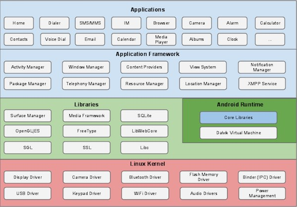

# [android](https://github.com/OS-Q/android) 

#### 归属系统：[OS-Q](https://github.com/OS-Q/OS-Q)

## [android简介](https://github.com/OS-Q/android/wiki) 

[android](https://github.com/OS-Q/android)是一种基于Linux的自由及开放源代码的操作系统。主要使用于移动设备，由Google（谷歌）公司和开放手机联盟领导及开发，是统治当前移动端的操作系统。

Android 提供了一个统一的应用程序开发方法，这意味着开发人员只需要为 Android 进行开发，这样他们的应用程序就能够运行在不同搭载 Android 的移动设备上。

Android 源代码是根据自由和开放源码软件许可证。谷歌发布的大部分代码遵循 Apache 许可证2.0版，Linux 内核的变化遵循 GNU 通用公共许可证版本2。

### [相关资源](https://github.com/OS-Q/android)

* [系统编译环境](docs/)
* [系统烧录工具](https://github.com/OS-Q/PhoenixCard)

### [Q : Operation System for edge devices](http://www.OS-Q.com)
####  2019-7-6
